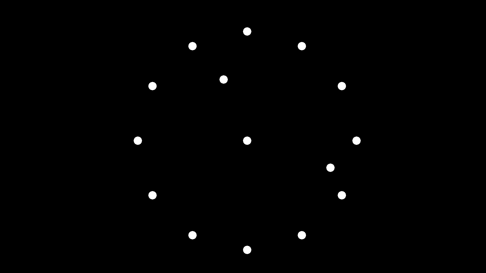

# DotSaver

A screensaver, completed in June 2012.

一个屏幕保护程序, 完成于 2012 年 6 月 (大概初二).

不知道在什么杂志上看到了一种[概念手表](https://www.baidu.com/s?wd=TIWE%E6%A6%82%E5%BF%B5%E6%89%8B%E8%A1%A8), 觉得很有意思, 于是做了一个类似的屏幕保护程序.

这个屏保会在屏幕上显示一大堆随机的点, 这些点每隔一段时间会被打乱, 或者组成一个时钟的图案, 用来展示当前时间.

## Copyright and License

Copyright (C) 2010-2012 MaxXSoft (MaxXing). License GPLv3.
